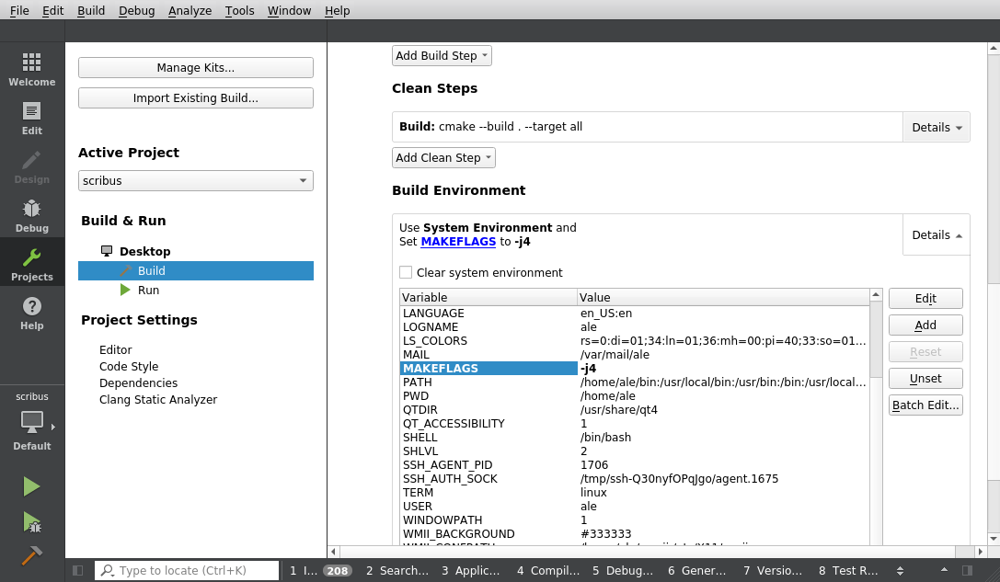
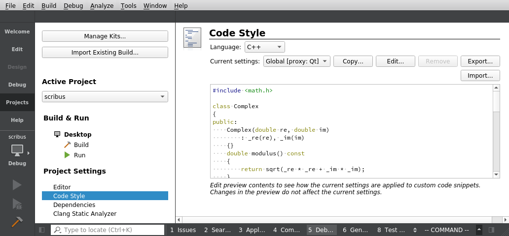
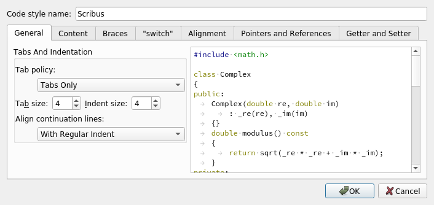

# Using Qt Creator with Scribus

## Getting and compiling Scribus

### Getting the Scribus project

Qt Creator can _automatically_ fetch and compile the Scribus code from the Github mirror.

When creating the new project, just give the address:

```
https://github.com/scribusproject/scribus.git
```

or – if you've already setup the ssh authentication –:

```
git@github.com:scribusproject/scribus.git
```

Qt Creator will detect the `cmake` configuration and – as long as the dependencies are met – start compiling Scribus.

## Using multiple cores

If you don't have `ninja` installed, by default Qt Creator compiles with only one core. If you want to improve the compilation speed, you can edit the project's configuration to ask gcc to build in parallel.

On Linux and OS X, look for the "Build" settings of the current "Project" , and ensure that in the "Build environment" you have a `MAKEFLAGS` Environment variable that says `-j4`.




You can change the `4` to a value gives you nice compile times, while matching the number of the cores in your computer.

## Running your own build of Scribus

Before being able to run Scribus with Qt Creator's "Run" command, you'll need to:

- Add an install step to the deployment configuration.
- Change the target install to a directory in your _home_.

### Installing Scribus before running it

Once Qt Creator has built Scribus, you can run it with the "Run" command. But, before being able to run your own build of Scribus, you have to make a further step: Scribus won't find its icons unless you first install.

You can tell Qt Creator to install Scribus before running it, by adding a "Deploy Step" to the Deployment configuration of the Run settings.

In the "Add deploy step" action, pick the "Build" option and make sure that the "install" target is checked:


### The target install directory

By default, Qt Creator installs Scribus in `/usr/local`, which on most systems needs the user to be `root` (In most cases, installing self compiled software outside of your own home directory is a bad idea, anyway).

You can change the target in the "Project"'s "Build and Run" configuration:


Then click the "Apply Configuration Changes" button below the list of the options.

Personally, I mostly use a `bin/scribus` directory in my home, but you can also use a `bin` directory in the build directory created by Qt Creator (`~/src/build-scribus-qt-creator-Desktop-Default/bin`).

You can also permanently modify the path used by Qt Creator by editing the "Kit"'s defaults:

- In `Tools > Options`, in the "Build & Run" section, pick the "Kits" tab.
- Click on "Manual > Dekstop (default)".
- Scroll down to the "CMake Configuration" and click on the "Change" button.
- Modify the line `CMAKE_PREFIX_PATH:STRING=%{Qt:QT_INSTALL_PREFIX}` to `CMAKE_PREFIX_PATH:STRING=%{Env:<HOME>}/bin` to install into the `bin` directory in your home.

Next time you add a project, Qt Creator will compile in your home and not in `/usr/local`.

### Indenting with tabs

The world has mostly settled to indenting with four or  two spaces, but Scribus sticks to the policy of using tabs in the files that are not automatically generated.

In the "Projects" tool, pick the _Project Settings_ for the _Code Style, make sure that the language is C++, and click on the "Edit..." button.



In the _Code Style_ dialog, click on "Copy Built-in Code Style", name the new style "Scribus" and pick the _Tab policy_ "Tabs Only".



Click on "OK" to save the new style and make sure that the _Current settings_ is now "Scribus".

### Debugging

If you want to run Scribus in debug mode, you need to edit the Build edit configuration in the "Projects > Build Settings". For the "Debug" build configuration, add to the Cmake section the value:

```
WANT_DEBUG              1
```

Don't forget to apply the change with the "Apply Configuration Changes" button below the list of the options.

Warning: setting `CMAKE_BUILD_TYPE=Debug` does not seem to have any effect, since the Scribus `CMakeLists.txt` file probably overwrites that value.
